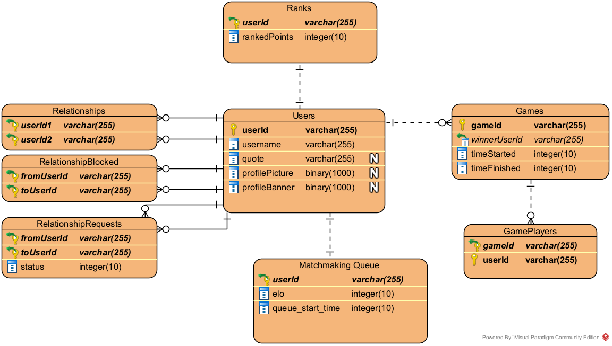
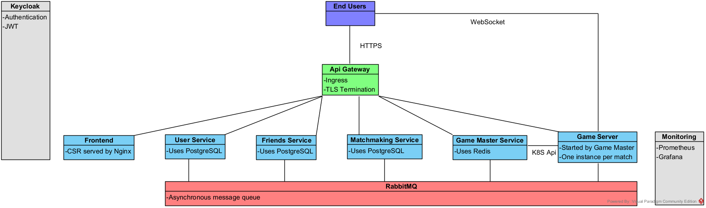
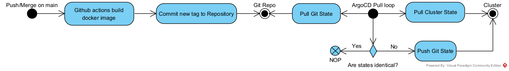
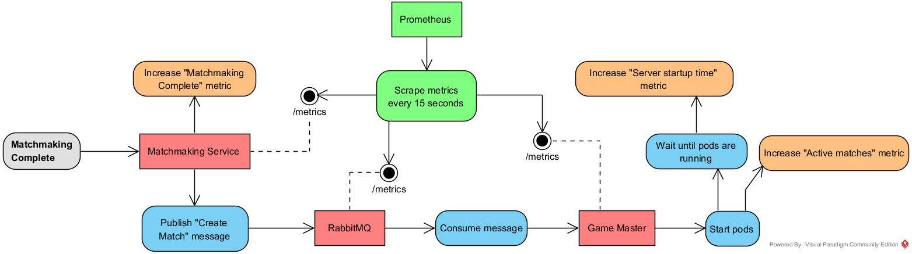
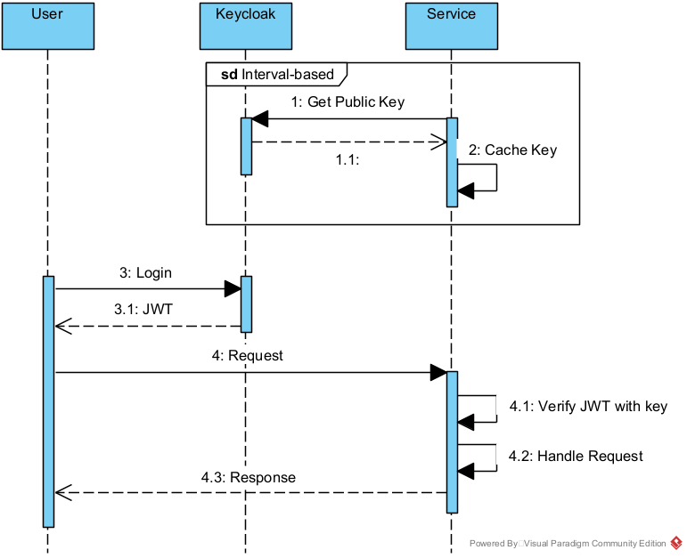

# System Documentation

## API Endpoint Structure

All endpoints are exposed as subpaths to the environment root. For example, leaderboard service has its endpoints for dev environment under the subpath `https://dev.ltu-m7011e-1.se/api/leaderboard/`. The frontend is hosted on the root `https://dev.ltu-m7011e-1.se/`. This means that requests from frontend to backend use the same domain. The frontend has something like `fetch("/api/leaderboard/me")`. The browser will then use the same domain as the webpage the fetch was called from. This structure allows the frontend to use the same code for requests regardless whether its currently in development or production environment. Another benefit is that all services are hosted on the same domain and therefore can share TLS certificate. Ingress acts as API gateway with rewrites so that it is easy to change the exact subpath each service lives on without having to rewrite that service. Each service sees the request as if it is coming from `/` (root). We can also more easily isolate each environment with this structure and minimize subdomain conflicts.

## Public Services and their subpaths

| Service             | Subpath             | Documentation                             | Test Coverage |
| ------------------- | ------------------- | ----------------------------------------- | ------------- |
| User Service        | `/api/user/`        | [README](./user-service/README.md)        | 88.05 %       |
| Friends Service     | `/api/friends/`     | [README](./friends-service/README.md)     | 83.33 %       |
| Matchmaking Service | `/api/matchmaking/` | [README](./matchmaking-service/README.md) | 82.49 %       |
| Leaderboard Service | `/api/leaderboard/` | [README](./leaderboard-service/README.md) | 0.00 %       |
| Game Master         | `/api/game-master/` | [README](./game-master/README.md)         | 91.66 %       |

## Developer services

These are services that our services depend on.

| Service    | Documentation                                |
| ---------- | -------------------------------------------- |
| ArgoCD     | [README](./argocd/README.md)                 |
| Keycloak   | No custom usage                              |
| RabbitMQ   | No custom usage                              |
| Prometheus | See each service for which metrics are used. |

## Database Schema

## Diagrams

